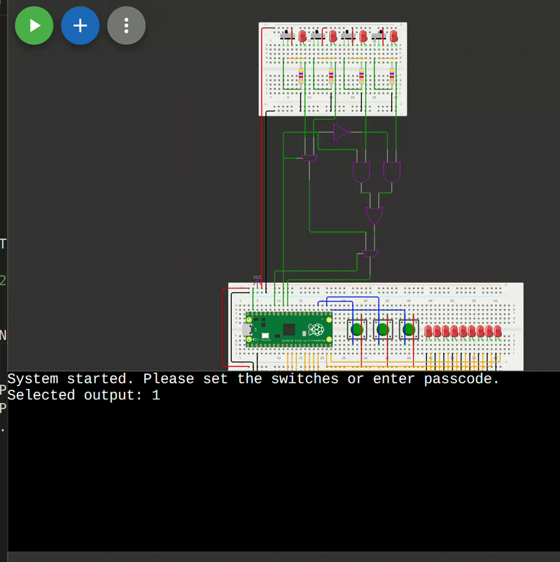

# Secure Device Controller using Raspberry Pi Pico

A microprocessor-based, digital device-control interface built with MicroPython. This project allows operators to securely toggle specific hardware devices (represented by LEDs) by selecting an output channel via multiplexed slide switches and entering a 3-digit passcode using debounced pushbuttons.

### Project Demonstration

## Features
* **Passcode Authentication:** Actions are only executed upon entering the correct 3-digit button sequence.
* **Hardware Interrupts & Debouncing:** Pushbuttons are handled via hardware interrupts (IRQs) with a 200ms debouncing guard window for clean signal reading.
* **Multiplexed Inputs:** Utilizes logic gates and 2-to-1 Multiplexers to read 4 slide switches using only 2 GPIO pins on the Pico, converting 4-bit binary inputs to decimal values.
* **Inactivity Timeout:** For security, the entered passcode sequence automatically clears after 3 seconds of inactivity.

## Hardware Components Used
* 1x Raspberry Pi Pico (RP2040)
* 3x Pushbuttons (Inputs)
* 4x Slide Switches (Inputs)
* 9x LEDs (Outputs D0-D8)
* Logic Gates (AND, OR, NOT) & Multiplexers

## How to Run the Simulation
This project was built and simulated using Wokwi. 
1. Open [Wokwi](https://wokwi.com/projects/462369677905551361).
2. Create a new Raspberry Pi Pico MicroPython project.
3. Replace the default `main.py` and `diagram.json` files with the ones in this repository.
4. Click the Play button to start the simulation. 
5. Set the desired output using the slide switches, then enter the passcode (Default: `0, 2, 1`) using the buttons.
